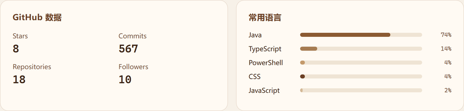

  

 

**咖啡** · Minecraft 模组 / Java 工具开发者

在方块世界里造城市，给 NPC 找路，也做混淆。

---

## 代表作

<table>
<tr>
<td width="33%" valign="top">

### [New: Sim-U-Kraft](https://github.com/New-Sim-U-Kraft/New-Simukraft-1.21.1)
**新模拟大都市**

Minecraft 城市与 NPC 生活模拟模组。建城、圈地、雇市民，把一座小镇做成能运转的都市。

`NeoForge 1.21.1` · `Forge 1.20.1`

</td>
<td width="33%" valign="top">

### [Kafuscator](https://github.com/kafei520-CN/Kafuscator)
**Java 混淆器**

面向 Java 字节码的混淆工具，用来保护模组与程序。

`Java` · `ASM`

</td>
<td width="33%" valign="top">

### [iPath](https://github.com/kafei520-CN/iPath)
**异步寻路库**

给 Minecraft 模组用的异步 A* 寻路：世界快照、路径搜索、实体走线分层。

`NeoForge` · `A*`

</td>
</tr>
</table>

---

## 技术栈

  

  Java · NeoForge · Forge · Mixin · Gradle · JavaScript · TypeScript

---

## GitHub

  

---

[主页](https://kafei520-cn.github.io) · [Bilibili](https://space.bilibili.com/566289712) · [GitHub](https://github.com/kafei520-CN)

